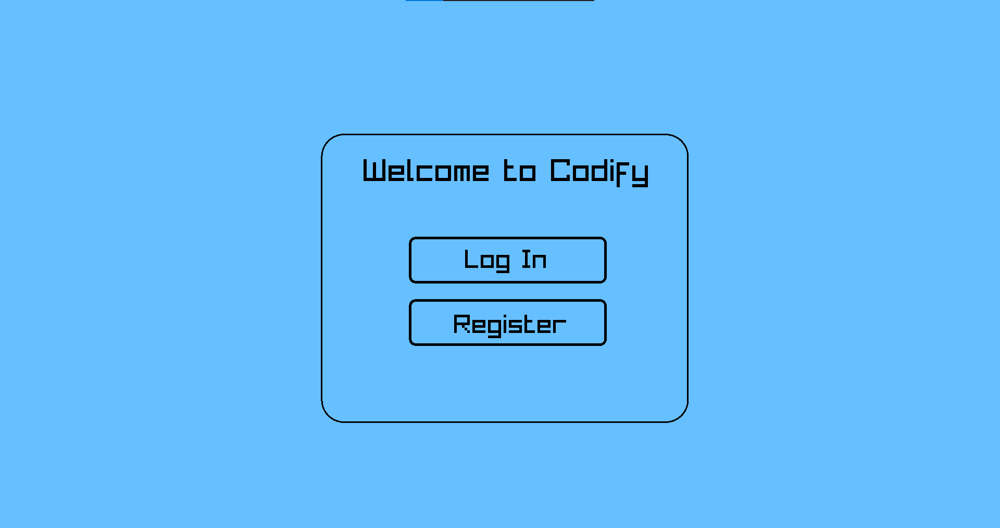

<div align="center"> </div>

##  About
<p>
   Our idea is to create a platform where students can improve their knowledge in different subjects.
</p>


##  Demo of our project
<div align = "center">
  
</div>


##  Installing
You can install our project by using this link:
```
   https://github.com/codingburgas/school-project-assignment-codify.git
```


##    Team members
| Iva Nedkova  | Bozhidar Dukov | Todor Ivanov | Konstantin Nachev | Dimitar Kostadinov |  Plamen Petkov |
| :---: | :---: | :---: | :---: | :---: | :---: |
| [INNedkova21](https://github.com/INNedkova21)  | [BNDukov21](https://github.com/BNDukovXXI) | [TPIvanov21](https://github.com/TPIvanov21) | [KKNachev22](https://github.com/KKNachev22)  | [DKKostadinov22](https://github.com/DKKostadinov22) | [PRPetkov22](https://github.com/PRPetkov22)
| Scrum Trainer | Back-end Developer | Back-end Developer |  Back-end Developer | Back-end Developer | QA |


##    Documents
-  [Documentation](https://codingburgas-my.sharepoint.com/:b:/g/personal/innedkova21_codingburgas_bg/EWc2Q3_qSilMnoJAFEszCXEBfCuGixFBLDkLIjIA9WNqMw?e=wEUn89)


##  Used technologies
         


<h3 align="center"> Thank you and enjoy our app! <h3>
<h4 align="center"> Made with ❤️</h4>
<h4 align="center"> Created by team Codify | &copy 2024 All rights reserved.</h4>
<h1 align="center">Thanks for checking out our repo, show us some ❤️ by giving our repo a ⭐️!</h1>


